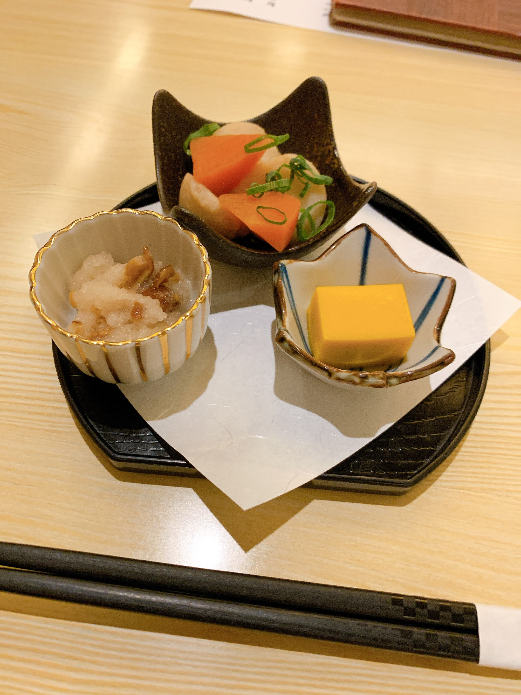
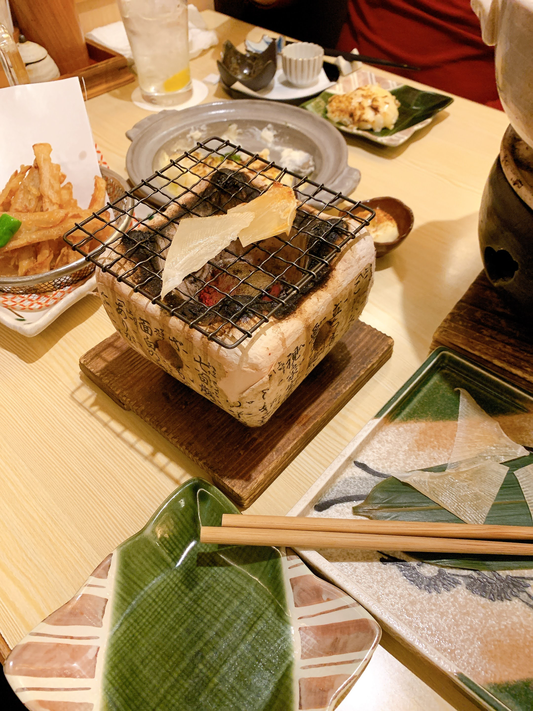
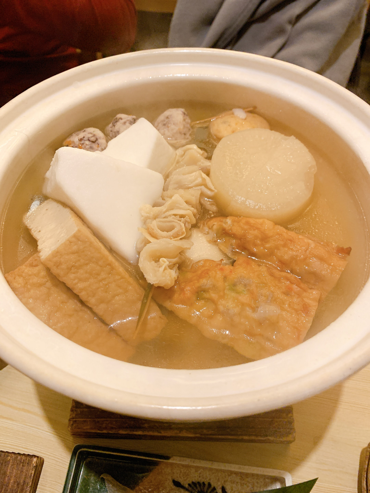
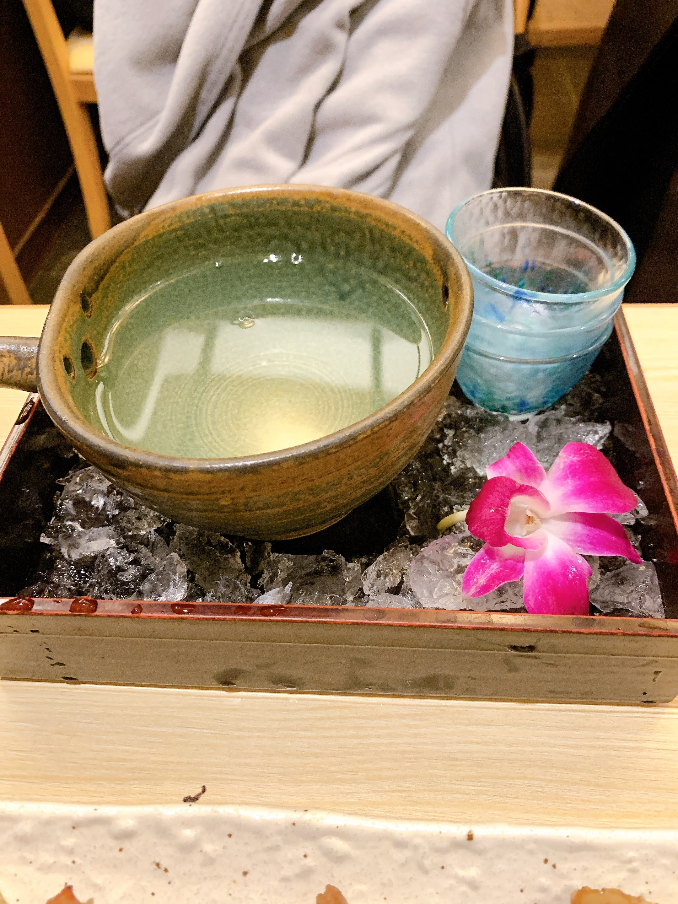

## ランチ　六本木一丁目 スペイン坂 鳥幸

焼き鳥丼も親子丼もうまかったけどこの日は鶏かつ煮御膳。

ここはなんでもうまいから今度夜の飲みでも使ってみたい。

## 夜　赤坂ごだいご

ぐるなびには「赤坂ごだいご」ってあるけど、行って看板見ると「北新地ごだいご」になっててちょっと戸惑う。

同僚が「おでん食いたい」って言い出してここに行こうとなったので会社からちょっと歩いて赤坂まで。

京風おでんがめっちゃうまいのと、自分で炙るエイヒレやら日本酒やらで優勝してきた。

- お通し

- エイヒレ炙り

- 京風おでん

- 日本酒（酔鯨）

